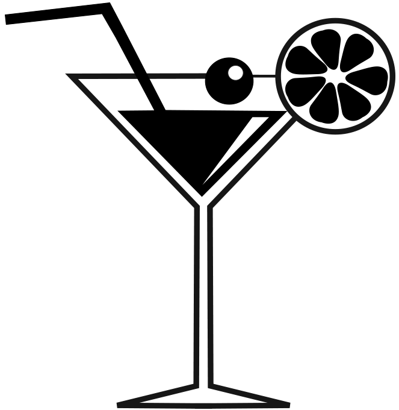

#Cocktail

Unsere Applikation ist eine Web-Bar in der man Drinks nach Namen suchen kann und dann die Zutaten, Zubereitung und ein Bild des Drinks sieht. In unserer Bar kann man sich auch einen Drink empfehlen lassen. Man kann auch nach Zutaten sortieren oder auch nach alkoholisch oder eben nicht.Für unsere Applikation benutzen wir TheCocktailDB als API. Unsere Entwickler sind [Luke Meier](https://github.com/LukeMeier), [Leon Heid](https://github.com/LeonHeid) und [Kian Ganz](https://github.com/KianGanz).

