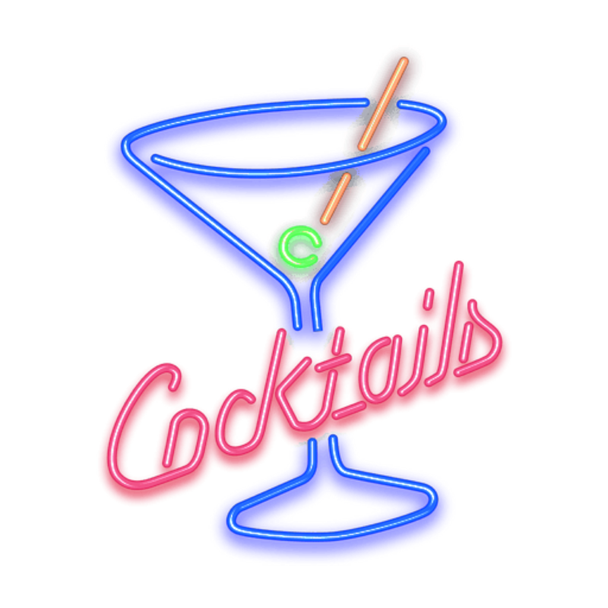

# Cocktail

Our application is a web bar where you can search for drinks by name and then see the ingredients, preparation and a picture of the drink. You can also have a drink recommended in our bar. You can also sort by ingredients or by alcoholic or not. For our application we use the [TheCocktailDB](https://www.thecocktaildb.com/) as an API. Our developers are: [Luke Meier](https://github.com/LukeMeier), [Leon Heid](https://github.com/LeonHeid) and [Kian Ganz](https://github.com/KianGanz).

